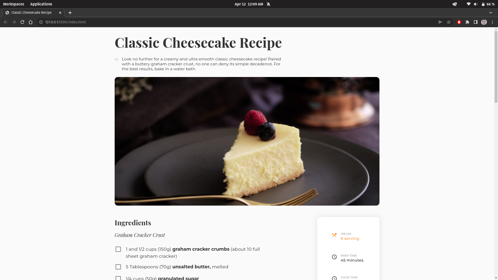

<!-- Please update value in the {}  -->

<h1 align="center">Recipe Blog</h1>

   Solution for a challenge from  <a href="http://devchallenges.io" target="_blank">Devchallenges.io</a>.

  <h3>
    <a href="https://lucasmelosilva.github.io/classic-cheesecake-recipe/">
      Demo
    </a>
     | 
    <a href="https://github.com/lucasmelosilva/classic-cheesecake-recipe">
      Solution
    </a>
     | 
    <a href="https://{your-url-to-the-challenge}">
      Challenge
    </a>
  </h3>

<!-- TABLE OF CONTENTS -->

## Table of Contents

- [Overview](#overview)
  - [Built With](#built-with)
- [Contact](#contact)

<!-- OVERVIEW -->

## Overview

A demostração da página pode ser encontrada [aqui](https://lucasmelosilva.github.io/classic-cheesecake-recipe/)

### Built With

<!-- This section should list any major frameworks that you built your project using. Here are a few examples.-->

- HTML
- CSS
- JavaScript

## Contact

- E-mail: lucas.melo044@gmail.com
- whatsapp: (81) 9.8903-0704
